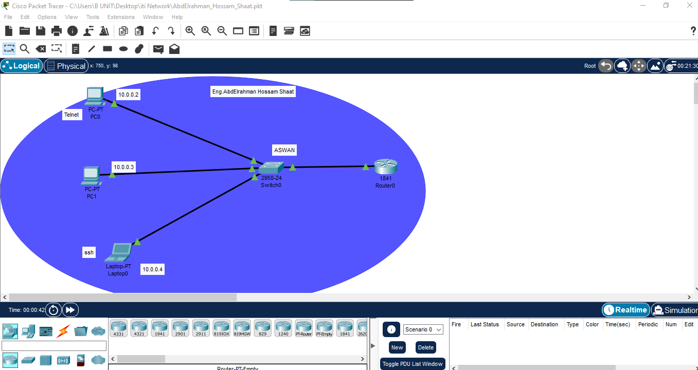
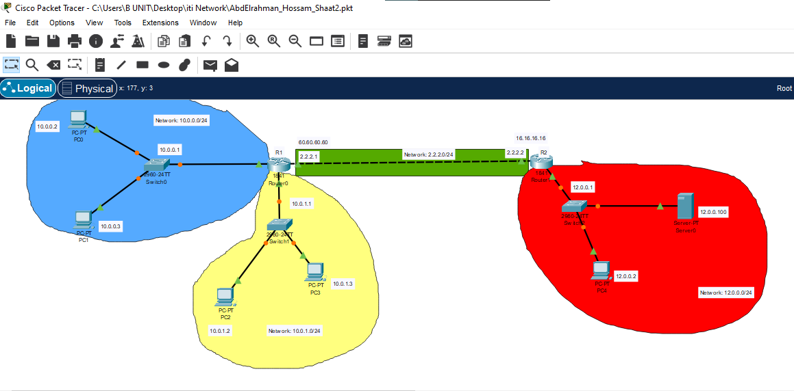
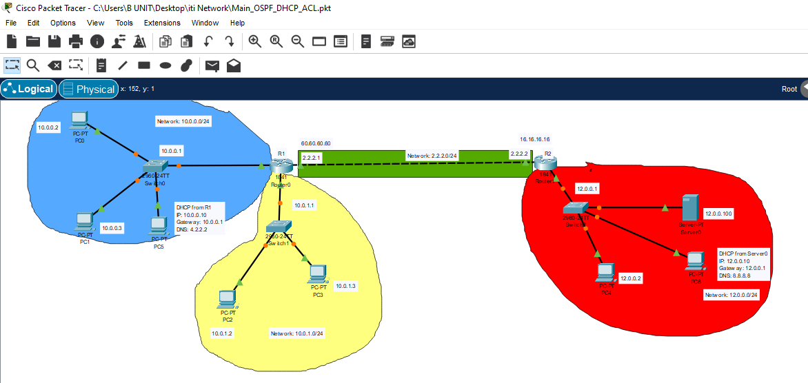
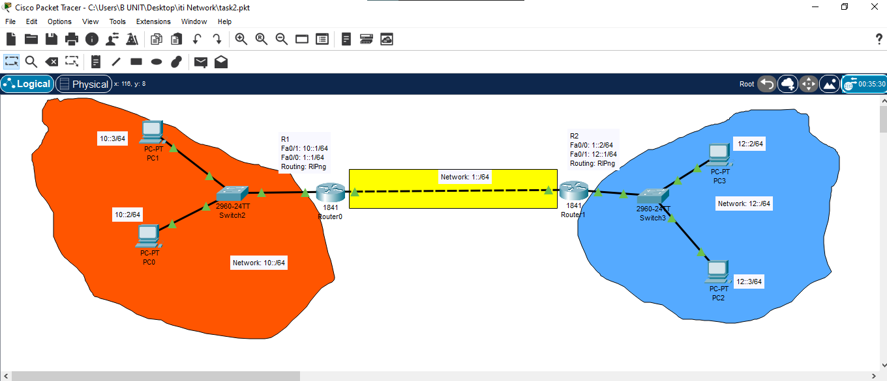
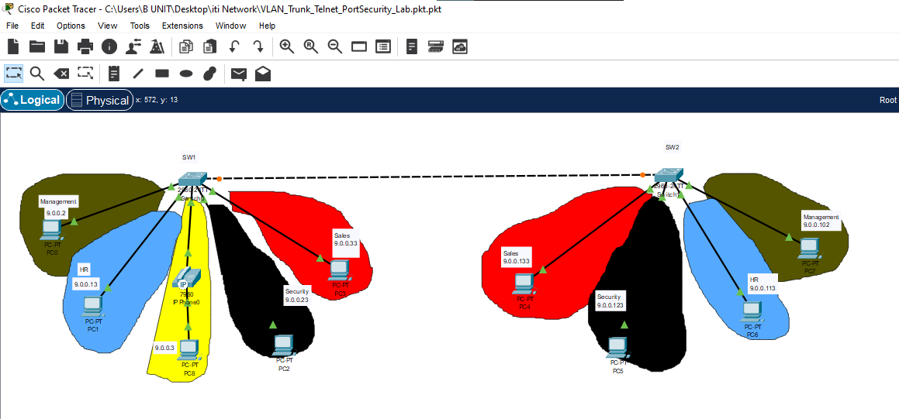
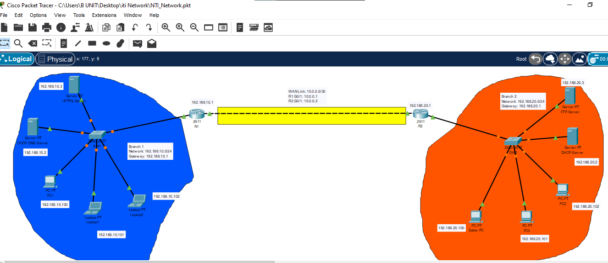

# Cisco Packet Tracer Networking Labs

A collection of hands-on networking labs built with Cisco Packet Tracer. The repository demonstrates practical work in switching, routing, network services, secure remote management, and basic endpoint/network security.

## Lab Files

| # | File | Main topic |
|---:|---|---|
| 1 | [`labs/01-telnet-ssh-remote-access-basic.pkt`](labs/01-telnet-ssh-remote-access-basic.pkt) | Basic Telnet and SSH remote-access topology |
| 2 | [`labs/02-ospf-dhcp-acl.pkt`](labs/02-ospf-dhcp-acl.pkt) | OSPF routing, DHCP address assignment, and access control lists |
| 3 | [`labs/03-ipv6-ripng-routing.pkt`](labs/03-ipv6-ripng-routing.pkt) | IPv6 addressing and dynamic routing with RIPng |
| 4 | [`labs/04-spanning-tree-protocol.pkt`](labs/04-spanning-tree-protocol.pkt) | STP topology and loop prevention |
| 5 | [`labs/05-vlan-trunk-telnet-port-security.pkt`](labs/05-vlan-trunk-telnet-port-security.pkt) | VLANs, trunking, Telnet, and switch port security |
| 6 | [`labs/06-telnet-ssh-remote-access-task.pkt`](labs/06-telnet-ssh-remote-access-task.pkt) | Telnet and SSH remote device administration task |
| 7 | [`labs/07-two-branch-network-services.pkt`](labs/07-two-branch-network-services.pkt) | Two-branch WAN with DHCP, DNS, HTTPS, and FTP services |
| 8 | [`docs/windows-network-security-lab.pdf`](docs/windows-network-security-lab.pdf) | Email service, malware checking, firewall rules, Nmap scanning, and RDP |

## Topics Covered

- IPv4 addressing and subnet configuration
- Router and switch CLI configuration
- Static and dynamic routing practice
- IPv6 addressing and RIPng
- OSPF routing, DHCP, and access control lists (ACLs)
- Spanning Tree Protocol (STP)
- VLAN creation and trunk links
- Telnet and SSH remote access
- Switch port security
- DHCP, DNS, HTTP/HTTPS, and FTP services
- Multi-branch network design
- Windows Firewall and basic Nmap reconnaissance

## Topology Previews

### Telnet and SSH Remote Access



### OSPF, DHCP, and ACL

#### Topology Overview



#### Configured Lab



### IPv6 RIPng Routing



### VLAN, Trunk, Telnet, and Port Security



### Two-Branch Network Services



## Requirements

- [Cisco Packet Tracer](https://www.netacad.com/cisco-packet-tracer)
- A PDF reader for the accompanying report

## How to Use

1. Download or clone this repository.
2. Open any `.pkt` file using Cisco Packet Tracer.
3. Inspect the topology and device addressing.
4. Open the CLI of each router or switch and review its running configuration.
5. Test connectivity with tools such as `ping`, `tracert`/`traceroute`, `ssh`, and `telnet` where applicable.

## Repository Structure

```text
.
├── labs/     # Cisco Packet Tracer lab files
├── assets/   # Topology preview images
├── docs/     # Supporting lab documentation
└── README.md
```

## Author

**AbdElrahman Hossam Shaat**  
Cybersecurity Student  
[GitHub Profile](https://github.com/abdelrahmanhossamshaat0001)

> These labs were created for educational and portfolio purposes. Use security-related techniques only in systems and environments you own or are explicitly authorized to test.
